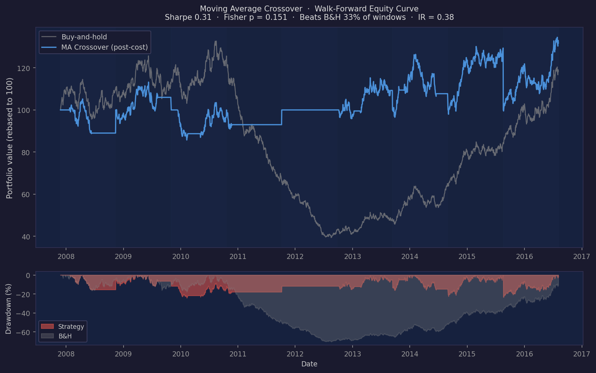

# backtesting-engine
[](https://github.com/bonnie-mcconnell/backtesting-engine/actions/workflows/ci.yml)
[](https://www.python.org/downloads/)
[](LICENSE)

A walk-forward backtesting framework for testing whether systematic trading strategies survive realistic execution costs and multiple-comparison correction.

The short answer for SPY 1993–2024: none of the three strategies tested (moving average crossover, Kalman filter trend-following, time-series momentum) produce statistically significant excess returns over buy-and-hold after 0.1% transaction costs and 5% slippage.

That result is the point.

---

## Why I built this

I was reading papers on time-series momentum and kept running into a specific frustration: the backtests in papers use daily close prices, no transaction costs, and report a single in-sample Sharpe. That's not a backtest - it's a correlation study. I wanted to understand what happens when you add realistic frictions and proper out-of-sample testing. The short answer, at least for SPY, is that the strategies stop working. That result took two months to produce properly and is what this project is.

This is not a strategy execution framework like backtrader or zipline. It's a hypothesis-testing framework - the output is a p-value and a confidence statement, not a trade log. The walk-forward design, the block bootstrap, and White's Reality Check exist specifically to make the null result credible rather than just convenient.

The Kalman filter was the hardest part. Getting MLE calibration right in log-space with a diffuse prior at each window boundary took longer than I expected - the filter diverges on short training windows if you initialise P₀ naively, and the likelihood surface has a shape that breaks gradient methods near Q→0. I ended up using Nelder-Mead on log(Q) and log(R), which is slow but stable. The calibrated SNR shifts across walk-forward windows in a way that tracks the 2000–2002 and 2007–2009 drawdowns, which is at least consistent with documented regime changes in equity volatility, even if it doesn't produce alpha.

I also wanted to understand White's Reality Check from an implementation standpoint. The paper is clear on the theory; the implementation details (centring the bootstrap, handling flat-cash windows, maintaining candidate matrix parity across windows) are less obvious. Working through those made the data-snooping correction concrete in a way the paper doesn't.

---

## Quickstart

```bash
git clone https://github.com/bonnie-mcconnell/backtesting-engine
cd backtesting-engine
poetry install
make run-quick    # MA crossover on SPY, ~3 min, good first look
```

For the full results (all three strategies + cost sensitivity):

```bash
make run-frozen   # frozen to 2024-12-31, ~15 min
```

Test whether the null result holds across asset classes (SPY, QQQ, TLT, GLD):

```bash
make run-multi
```

Outputs `results/dashboard_ma.html`, `results/dashboard_kalman.html`, `results/dashboard_momentum.html`, `results/cost_sensitivity.html`. Open any in a browser - they're self-contained HTML with embedded Plotly JS, no server required.

Data is downloaded from Yahoo Finance via yfinance on first run and cached to `~/.cache/backtesting-engine/`. If a run fails with a network error, see [docs/reproducibility.md](docs/reproducibility.md).

---

## Results

The full numerical results are in [RESULTS.md](RESULTS.md). The short version: nothing is significant at p < 0.05 on any test, and all three strategies underperform buy-and-hold on a risk-adjusted basis.

The chart below is generated by the actual engine on 12 years of synthetic data (GBM with a 2008-style drawdown added). It uses the same `walk_forward` + `compute_benchmark` calls the CLI uses. The step-function periods are cash - when no MA crossover fires, the strategy sits flat. The real SPY run (`make run-frozen`, ~15 min) produces the same pattern: smaller drawdowns than B&H, lower long-run returns, Fisher p well above 0.05.



**Dashboard panels (6 per strategy):**

1. Equity curve - per-window portfolio values stitched vs buy-and-hold across the full test period
2. Per-window Sharpe - strategy vs benchmark Sharpe for each test window, coloured vs that window's B&H (not the aggregate)
3. Rolling drawdown - maximum drawdown at each point across the full test period
4. Parameter evolution - how calibrated parameters drift across windows (MA windows, Kalman SNR, momentum lookback)
5. Returns distribution - histogram of daily returns vs Normal fit
6. Trade diagnostics - per-trade P&L, holding period distribution, win rate by window

See [docs/reproducibility.md](docs/reproducibility.md) for environment details,
[docs/methodology.md](docs/methodology.md) for statistical methodology,
[docs/architecture.md](docs/architecture.md) for data flow and design decisions,
and [docs/performance.md](docs/performance.md) for expected runtimes.

---

## Library usage

The CLI is the main interface, but all components are importable. The public API is
everything exported from `backtesting_engine.__init__`.

**Run a single strategy programmatically:**

```python
from backtesting_engine import (
    load_data, validate_data,
    walk_forward, compute_benchmark,
    MovingAverageStrategy, ExecutionConfig,
)

data = load_data("SPY", "1993-01-01", end_date="2024-12-31")
validate_data(data, min_rows=1260)  # 5 years minimum for 3yr train + 1yr test

execution = ExecutionConfig(
    transaction_cost_rate=0.001,
    slippage_factor=0.05,
    signal_delay=1,
)

result = walk_forward(
    data,
    MovingAverageStrategy(),
    training_window_years=3,
    testing_window_years=1,
    execution=execution,
)

benchmark = compute_benchmark(result, data, execution=execution)

m = result.summary_metrics
print(f"Sharpe:      {m.sharpe_ratio:.3f}")
print(f"Fisher p:    {m.combined_p_value:.4f}")
print(f"RC p (cash): {m.reality_check_p_value:.4f}")
print(f"RC p (B&H):  {m.reality_check_bh_p_value:.4f}")
print(f"IR:          {benchmark.information_ratio:.3f}")
```

**Write results to JSON for downstream use:**

```python
from backtesting_engine import write_summary_json
from pathlib import Path

write_summary_json(
    [("MA Crossover", result, benchmark)],
    Path("results/summary.json"),
    ticker="SPY",
    execution=execution,
)
```

**Compare two strategies:**

```python
from backtesting_engine import KalmanFilterStrategy, MomentumStrategy

kalman_result = walk_forward(data, KalmanFilterStrategy(), execution=execution)
momentum_result = walk_forward(data, MomentumStrategy(), execution=execution)

for name, res in [("MA", result), ("Kalman", kalman_result), ("Momentum", momentum_result)]:
    m = res.summary_metrics
    print(f"{name:10s}  sharpe={m.sharpe_ratio:.3f}  fisher_p={m.combined_p_value:.4f}")
```

The `ExecutionConfig` defaults (cost=0.1%, slippage=5%, delay=1) match the CLI
defaults. Zero-friction runs require an explicit
`ExecutionConfig(transaction_cost_rate=0, slippage_factor=0, signal_delay=0)`.

---

## Architecture

```
src/backtesting_engine/
├── strategy/
│   ├── base.py              BaseStrategy interface + returns_from_signals
│   ├── moving_average.py    Grid-search calibrated MA crossover
│   ├── kalman_filter.py     MLE-calibrated local level Kalman filter
│   └── momentum.py          Lookback grid-search time-series momentum
├── data/
│   ├── ingestion.py         yfinance + split/div-adjusted H/L + Parquet cache
│   └── validator.py         Schema, missing-value, and range checks
├── execution.py             Slippage, delay, cost model + cost sensitivity sweep
├── walk_forward.py          Rolling train/test with position carry-over
├── reality_check.py         White's (2000) Reality Check
├── metrics.py               Sharpe, Sortino, Calmar, Omega, block bootstrap p
├── benchmark.py             Buy-and-hold comparison, Information Ratio, paired t-test
├── multi_asset.py           Cross-asset validation: same strategy across ticker universe
├── summary.py               JSON and CSV output serialisation (--summary-json/--summary-csv)
├── simulator.py             Reference simulator (readable baseline, zero-friction)
├── models.py                Dataclasses: Trade, SimulationResult, WindowResult, etc.
├── dashboard.py             6-panel interactive Plotly dashboard
├── config.py                All constants in one place
└── main.py                  CLI entry point
```

### The strategy interface

Every strategy implements four methods:

```python
strategy.fit(train_data)                          # calibrate parameters in-sample
strategy.generate_signals(data)                   # pd.Series of {-1, 0, 1}
strategy.candidate_test_returns(test, context)    # dict[param → return series] for RC
strategy.active_params()                          # dict of calibrated parameter values
```

Adding a new strategy means implementing this interface. The walk-forward runner, Reality Check, and dashboard work without modification.

---

## Key design decisions and tradeoffs

**`ExecutionConfig` defaults match the CLI.** Calling `walk_forward(data, strategy)` without an explicit `ExecutionConfig` uses cost=0.1%, slippage=5% of daily range, delay=1 bar - the same conservative model the CLI uses. There is no hidden "optimistic" mode when using the library programmatically. Zero-friction runs (for verifying strategy logic in isolation) require an explicit `ExecutionConfig(transaction_cost_rate=0, slippage_factor=0, signal_delay=0)`.

**Walk-forward, not a single in/out split.** A single optimisation followed by one out-of-sample test gives you one data point. Walk-forward gives ~26 independent test windows. Fisher combination across those windows is more informative than a single aggregate Sharpe, and you can see whether performance is consistent or just driven by one lucky window.

**Block bootstrap with centred null.** Return series from trend-following have serial correlation that violates the iid assumption underlying parametric Sharpe tests. Block bootstrap preserves autocorrelation by resampling contiguous blocks. The critical implementation detail: returns are centred (mean subtracted) before resampling. Without centring, the bootstrap distribution inherits the strategy's observed drift, and p(boot_sharpe ≥ observed_sharpe) ≈ 0.5 for any positive-drift strategy regardless of signal quality. Centring anchors H₀ at zero mean explicitly.

**White's Reality Check for grid search correction.** MA crossover evaluates ~112 candidate (short, long) combinations per training window. Picking the best performer without accounting for the search gives a biased result. RC bootstraps the full candidate return matrix simultaneously, preserving cross-candidate correlations, so the p-value accounts for the number of combinations tried.

**Adjusted high/low, not just adjusted close.** The execution model fills at `close ± slippage_factor × (high - low)`. If close is dividend-adjusted but high/low are not, the close can sit outside the [low, high] band on ex-dividend dates, making the fill price nonsensical. All three price columns use the same adjustment factor.

**No-trade windows as flat-cash, not excluded.** A window where the strategy makes no trades is a valid outcome - the strategy held cash. These windows contribute Sharpe = 0 and p = 1.0 to the summary rather than being excluded. Excluding them would bias the aggregate Sharpe upward by dropping a real outcome from the record.

**Cost-inclusive position sizing.** `position_value = cash × fraction / (1 + cost_rate)` so that `position_value + buy_cost = cash × fraction` exactly. The intuitive formula (`position_value = cash × fraction`, then subtract cost) creates a small negative cash balance after every trade.

**Benchmark cost and slippage parity.** The buy-and-hold benchmark applies the same `transaction_cost_rate` and `slippage_factor` from `ExecutionConfig` as the strategy. The strategy pays both frictions on every fill; the benchmark pays them on its one round-trip entry and exit per window. This makes the comparison consistent across cost sensitivity sweeps.

---

## Statistical test hierarchy

Ordered from weakest to strongest:

1. **Block bootstrap p (per window)** - does one window beat the zero-mean null?
2. **Fisher combined p** - do the windows collectively beat the zero-mean null? (approximate: windows not independent)
3. **White's RC p (vs cash)** - does the best parameter combination survive multiple-comparison correction against the zero-return null?
4. **White's RC p (vs B&H)** - does the best parameter combination survive multiple-comparison correction against the buy-and-hold null? Resamples active returns (strategy minus B&H), so the test directly asks whether there is alpha after passive is available as the alternative. A strategy that beats cash (RC p vs cash is small) but not B&H (RC p vs B&H is large) is capturing market beta, not generating alpha.
5. **Beats B&H fraction** - in what fraction of windows does strategy Sharpe exceed buy-and-hold?
6. **Information Ratio + paired t-test** - does the strategy add consistent risk-adjusted value over buy-and-hold?

Tests 1–4 answer "is there any signal at all?" Tests 5–6 answer "does it matter in practice?" The headline claim uses 5 and 6.

---

## CLI reference

```
backtesting-engine [options]

--strategy {ma,kalman,momentum,all}   Strategy to run (default: all)
--ticker SYMBOL                        Ticker symbol (default: SPY)
--start YYYY-MM-DD                     Start date (default: 1993-01-29)
--end YYYY-MM-DD                       End date, inclusive (default: today).
                                       --end 2024-12-31 includes December 31.
                                       Set this for reproducible results.
--cost RATE                            Transaction cost per side (default: 0.001)
--slippage FACTOR                      Fraction of daily range (default: 0.05)
--delay BARS                           Signal execution delay in bars (default: 1)
--train-years N                        Training window in years (default: 3)
--test-years N                         Test window in years (default: 1)
--output-dir DIR                       Output directory (default: .)
--seed N                               Bootstrap random seed (default: 42)
                                       Set explicitly for fully reproducible results.
--no-cache                             Force fresh data download
--costs-only                           Run cost sensitivity sweep only
--summary-json PATH                    Write JSON summary to PATH (all MetricsResult
                                       and BenchmarkResult fields, one entry per strategy)
--summary-csv PATH                     Write CSV summary to PATH (same data, flattened,
                                       one row per strategy)
--no-dashboard                         Skip all HTML dashboard generation
                                       (results still printed to stdout)
--workers N                            Parallel workers for cost sensitivity sweep
                                       (default: 1; -1 uses all cores; increase on Linux/macOS)
```

Cross-asset validation runs as a separate command:

```
backtesting-multi [options]

--tickers TICKER [TICKER ...]          Tickers to test (default: SPY QQQ TLT GLD)
--strategy {ma,kalman,momentum,all}    Strategy to run on each ticker (default: ma)
                                       'all' runs all three in sequence
--start YYYY-MM-DD                     Start date (default: 2005-01-01)
--end YYYY-MM-DD                       End date, inclusive (default: today)
--cost RATE                            Transaction cost per side (default: 0.001)
--slippage FACTOR                      Fraction of daily range (default: 0.05)
--delay BARS                           Signal execution delay in bars (default: 1)
--train-years N                        Training window in years (default: 3)
--test-years N                         Test window in years (default: 1)
--output-dir DIR                       Output directory (default: .)
--seed N                               Bootstrap random seed (default: 42)
--no-dashboard                         Skip per-ticker dashboard generation
```

---

## Tests

```bash
make test     # full suite
make check    # lint + typecheck + tests
```

472 tests across unit, integration, and CLI layers. Key correctness invariants covered:

- Execution model: slippage, signal delay, backward compat
- Position sizing: no negative cash after any trade sequence
- Block bootstrap: null centring (p ≈ 0.5 for zero-signal series)
- Reality Check: flat-cash window parity; boundary carry-over parity
- Benchmark: cost/slippage parity; per-window Sharpe accuracy
- Data ingestion: yfinance retry logic; ex-dividend clip; missing column handling
- CLI: `--end` inclusive offset; `--no-dashboard` suppression; `--workers` forwarding

---

## Known limitations

- Fisher combination is approximate because walk-forward windows are not fully independent.
- Bootstrap block length is fixed at √n. Optimal length depends on autocorrelation structure (Politis & White 2004).
- yfinance data can have revision errors the validator does not catch.

Full discussion in [docs/methodology.md](docs/methodology.md).

---

## What I would do next

**EM algorithm for Kalman MLE.** Nelder-Mead is embarrassingly slow for the local-level model - it re-runs the full Kalman filter on every function evaluation, which means ~2,000 filter passes per walk-forward window. The EM algorithm has a closed-form E-step for this model; it should converge in maybe 30 iterations. The math is in Harvey (1989), chapter 4. I didn't implement it because Nelder-Mead was correct first and I didn't want to introduce a second calibration path until the first one was well-tested.

**Automatic block length selection.** The √n block length is a reasonable heuristic but it's not calibrated to the actual autocorrelation structure of the series. Politis & White (2004) give a data-driven method. The main reason I didn't do this is that the optimal block length varies by strategy and asset, which would make the RC results harder to interpret across runs - you'd need to report the block length alongside the p-value.

**More assets and longer history.** The 1993 start date is driven by SPY's inception. Running on individual equities with longer histories (or on futures, where history goes back further) would let you test whether the null result holds outside ETFs. My prior is that it does, but I haven't verified it.

**Live paper trading integration.** The walk-forward architecture naturally supports a "retrain on all available history, generate next signal" mode that could feed into a paper trading account. The signal generation path already exists; you'd need a broker API connection and some state management for open positions.

---

## References

- White, H. (2000). A Reality Check for Data Snooping. *Econometrica*, 68(5), 1097–1126.
- Grinold, R. & Kahn, R. (2000). *Active Portfolio Management*, 2nd ed. Chapter 2.
- Kunsch, H.R. (1989). The Jackknife and the Bootstrap for General Stationary Observations. *Annals of Statistics*, 17(3), 1217–1241.
- Politis, D.N. & Romano, J.P. (1994). The Stationary Bootstrap. *JASA*, 89(428), 1303–1313.
- Moskowitz, T.J., Ooi, Y.H. & Pedersen, L.H. (2012). Time Series Momentum. *Journal of Financial Economics*, 104(2), 228–250.
- Harvey, A.C. (1989). *Forecasting, Structural Time Series Models and the Kalman Filter*. Cambridge University Press.
- Politis, D.N. & White, H. (2004). Automatic Block-Length Selection for the Dependent Bootstrap. *Econometric Reviews*, 23(1), 53–70.
- Lesmond, D.A., Ogden, J.P. & Trzcinka, C. (1999). A New Estimate of Transaction Costs. *Review of Financial Studies*, 12(5), 1113–1141. The 0.1% per side default is consistent with their estimates for liquid US equity ETFs.

---

## License

MIT - see [LICENSE](LICENSE).
